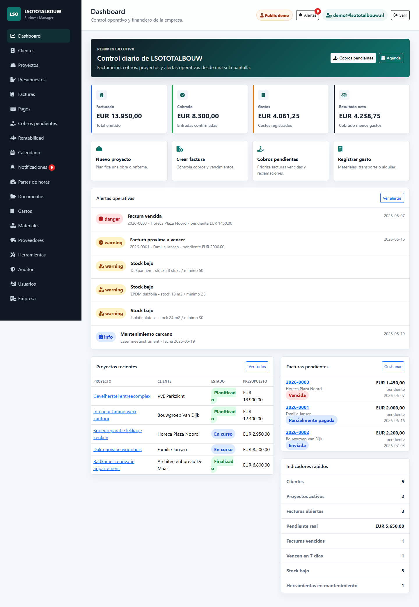
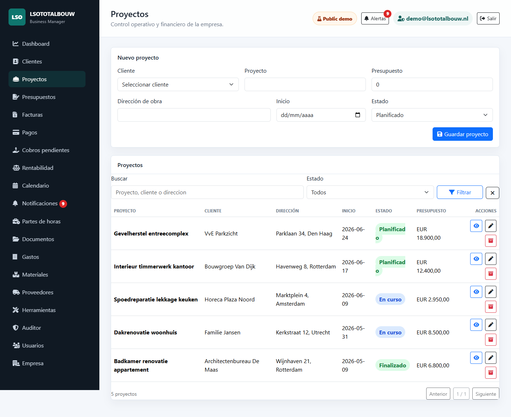
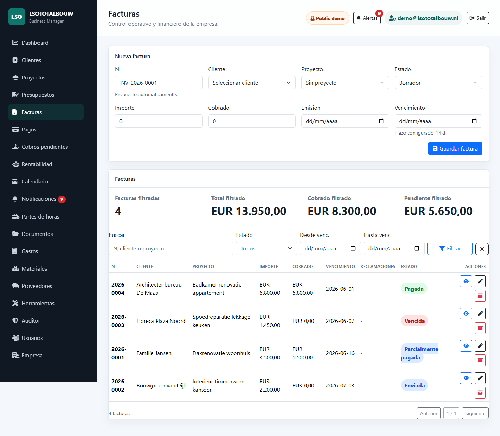
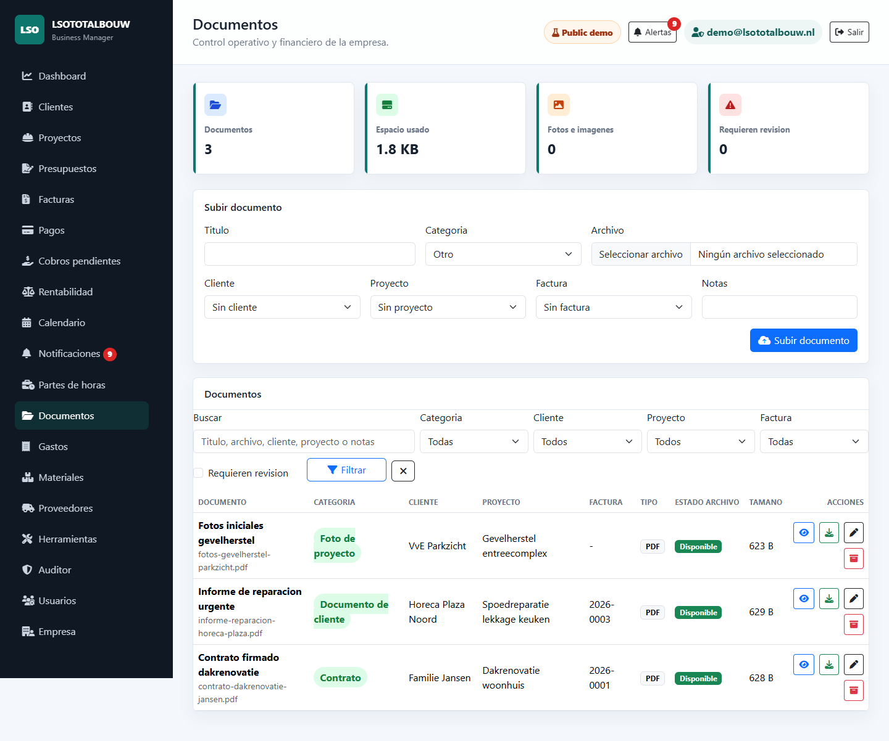
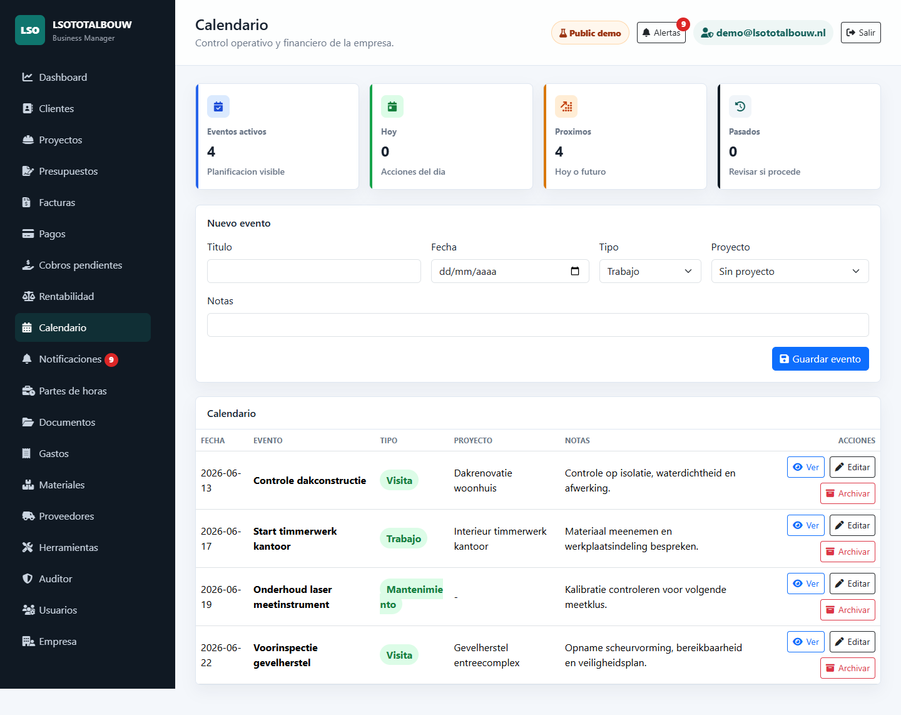
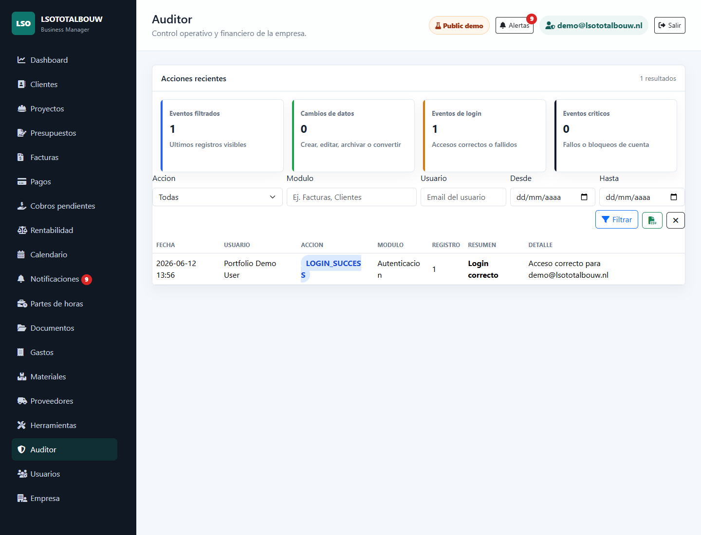

# LSOTOTALBOUW Business Manager

Professional SaaS-style business management platform for construction contractors and small building companies.

LSOTOTALBOUW centralizes daily operations for a self-employed contractor or small construction business: customers, projects, quotations, invoices, payments, receivables, expenses, materials, tools, documents, calendar planning, work logs, users, roles, notifications, and audit history.

## Portfolio Demo

This repository includes a public demo profile designed for portfolio and recruiting purposes.

- Live demo: https://lsototalbouw-demo.onrender.com
- Demo profile: `demo`
- Demo user: `demo@lsototalbouw.nl`
- Demo password: `Demo2026!`
- Data: fictional construction business records only
- Access mode: read-only, so public visitors cannot change, delete, or upload data
- Purpose: show product thinking, software architecture, security baseline, and enterprise workflow implementation

Do not enter real personal, customer, financial, or business data in the public demo environment.

## Screenshots

### Dashboard



### Core Modules

| Projects | Invoices |
| --- | --- |
|  |  |

| Documents | Calendar |
| --- | --- |
|  |  |

| Audit Trail |
| --- |
|  |

## Highlights

- Spring Boot MVC application with Thymeleaf and Bootstrap.
- Spring Security with role-based access control.
- Clean modular structure: controllers, services, repositories, entities, forms, and security components.
- Flyway-managed database migrations.
- MySQL-ready production profile and local H2/demo profiles.
- Invoicing, quotation conversion, payment tracking, receivables, profitability, expenses, calendar, documents, tools, materials, suppliers, users, and audit modules.
- Document upload validation, local security scanning hook, SHA-256 integrity checks, and document storage health.
- Operational scripts for release builds, smoke tests, backups, restore testing, preflight checks, and Go/No-Go decisions.
- Production documentation covering MySQL, backups, restore, security, GDPR/AVG considerations, and release handoff.

## Tech Stack

- Java 17
- Spring Boot 4
- Spring MVC
- Spring Security
- Spring Data JPA / Hibernate
- Thymeleaf
- Bootstrap 5
- Flyway
- H2 for local/demo
- MySQL for production
- Maven

## Run Locally

```powershell
.\mvnw.cmd spring-boot:run
```

Open:

```text
http://localhost:8080
```

Default local development login:

```text
admin@lsototalbouw.nl
Admin123!
```

## Run Public Demo Profile Locally

```powershell
$env:SPRING_PROFILES_ACTIVE="demo"
.\mvnw.cmd spring-boot:run
```

Demo login:

```text
demo@lsototalbouw.nl
Demo2026!
```

## Build And Verify

```powershell
.\mvnw.cmd -q clean test
.\scripts\build-release.ps1 -Label "release-candidate"
.\scripts\verify-release.ps1 -ReleasePath "releases/YYYYMMDD_HHMMSS-release-candidate" -RequireTests
```

## Documentation

- `docs/PORTFOLIO_DEMO.md`: public demo and LinkedIn/GitHub publishing plan.
- `docs/LINKEDIN_POST.md`: ready-to-use LinkedIn portfolio post in English and Spanish.
- `docs/PROJECT_HANDOFF_SUMMARY.md`: current readiness and release candidate status.
- `docs/FINAL_QA_CHECKLIST.md`: QA coverage and verification checklist.
- `docs/GO_NO_GO_CHECKLIST.md`: demo and production decision gate.
- `docs/PRODUCTION_ENVIRONMENT.md`: production environment variables and constraints.
- `docs/PRODUCTION_RUNBOOK.md`: deploy, backup, restore, rollback, and incident operations.
- `docs/SECURITY_DATA_PROTECTION.md`: data protection and production hardening notes.

## Public Demo Safety

The `demo` profile is intended for portfolio review only. It uses demo credentials, fictional data, H2 storage, a visible "Public demo" label, and a read-only guard that blocks state-changing requests. Real production use requires MySQL, HTTPS, scheduled backups, monitoring, secrets management, restore testing, and GDPR/AVG review.
